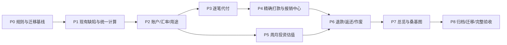

# 共筑 PRD v1.1 · 分期开发与验收计划

配套：[完整 PRD](/Users/ariel/Documents/ChatGPT/GongZhu/GongZhu-PRD-v1.1.md)、[测试与验收方案](/Users/ariel/Documents/ChatGPT/GongZhu/GongZhu-Test-Plan-v1.1.md)\
基线：`joint-deposit-record-app/main@3890578`\
状态：2026-09-12更新的规划稿，尚未开始开发；D-01报销方向已确认。P0—P8 是交付阶段；PR编号是未来建议拆分，不代表已创建 GitHub PR。

## 1. 开发顺序和交付方法

先建立统一核算与审批基础，再增加账户、汇率和消费分类；随后补齐代付/报销与投资；最后接入全量可视化、作废归档和历史迁移。

推荐实际顺序 P0→P1→P2→P3→P4→P5→P6→P7→P8，减少同时改动现有核心组件。每期按已确认的 PRD 范围完成小步改动、演示和验收；不为每个常规实现决定额外设置用户批准门槛。

每个实现 PR 均包含：对应需求、改动理由、沿用原设计说明、必要数据库迁移、领域/事务/权限测试、受影响页面对照、数据兼容说明。纯 UI 文案等轻量变更无需为实现细节编写重复测试。

## 2. P0：规则确认与现状保护

**目的：** 开发前明确资金方向，建立第一位开发者可以识别的产品和数据基线。

**交付物：** 通过评审的PRD、D-01资金方向结论、现有界面截图/组件基线、现有数据迁移盘点模板。没有真实环境时，只交付模板和测试数据预演；不声称线上数据已核对。

任务：

1. 采用已确认方向：个人存入流入共同账户、代付报销付给垫付成员；登记本次CNY显示、分类、显式资金来源、费用简化、涨跌幅和配置要求。
2. 保存当前四个页签、主要弹窗、移动端外观作为对照；整理现有配色、间距、卡片样式，继续复用。
3. 明确无自动银行/券商交易，无个人资产和资产份额。
4. 盘点现有 proposal、流水、投资、价格、币种、成员字段及未分配报销。
5. 定义迁移切换日和历史疑点清单格式，不直接修改生产数据。

**验收：** 任何人能用同一个案例说明“存入→消费/代付→报销→投资”的方向；设计改动边界和待核对历史项明确。

## 3. P1：先修复现有计算与审批基础

### PR-01：统一领域模型及已知计算缺陷

保留现有页面行为和布局，优先消除会算错钱的问题：

- 真实 UUID 成员模型替换固定演示成员；明确 submitter 与 payer 的领域字段。
- 投资按发生顺序和稳定序号回放；非法卖出明确失败，不静默跳过。
- 总览与领域计算统一入口，原币现金先分币种汇总；外币未有汇率时显示缺失，不相加。
- 修正外币分红币种、同日价格排序、缺价格假零、四位价格只保存两位等问题。
- 统一 proposal approved 与 ledger posted 的模型边界，禁止在线代码复用错误的演示状态。

**主要位置：** `src/lib/domain/*`、`src/app/app/page.tsx`、`src/app/app/app-client.tsx`、`price-modal.tsx`、相关增量迁移。

**验收：** PRD I-01/I-03通过；不同UI排序不改持仓；USD100+CNY720不显示USD820；缺失汇率不显示合计假值；未配置真实行情也不显示假实时价格。

### PR-02：审批、权限、请求幂等和完整汇总

- 按类型严格校验必填字段、精度和权威金额；买卖必须有数量及实际金额，参考报价不是必填也不强制等于含费扣款；数据库显式校验NULL。
- 固定一份草稿的幂等键，禁用提交中按钮，重复请求返回同一结果。
- 锁账本/标的/提案；所有RPC统一成员、资源同账本和active检查，包括旧入口。
- 分离全量服务端聚合与分页列表；统一错误响应，读失败不能显示0。
- 查询返回账本版本，Realtime变化后整体刷新。
- 修复邀请同账本并发人数检查、登录回跳、资料读取和失效邀请处理；验证pgcrypto在新旧库中的位置。
- 补齐驳回/撤回等审计，提供最小持续集成检查和运行说明。

**验收：** 超1000条流水汇总正确；自己不能自批；两人同时批准同一提案仅一次生效；跨账本查询/写入拒绝；相同草稿重试不新增；损坏输入不会半入账。

**独立交付价值：** 即使后续模块尚未上线，现有四页也不再保留已知的基础计算错误。需要新增汇率的数据仍明确显示缺失状态。

## 4. P2：共同账户、三币种和用途

### PR-03：银行/券商账户及现金明细

- 新账本创建两类共同账户；增量账户现金明细一次事务记录。
- 存入默认银行、交易结算默认券商；显式同币种划转原子落两边；为“银行转入并买入”组合记录固定转入和买入金额提供基础。
- 保留负余额，展示银行/券商原币明细；双向禁止自动补差、自动转账和自动换汇。
- 新旧现金事件适配互斥，不能双计。

**验收：** 银行600转券商200后400/200，共同现金仍600、贡献不变；券商现金不足买入时银行不变；银行支出变负时券商不变。组合转入300/买入200按固定金额原子生效，不因审批时余额变化改转入额。

### PR-04：汇率快照与换汇

- 手动USD基准汇率、时间和来源；批准后生效，所有历史引用不可变。
- 当前资产使用当前批准快照，历史消费/贡献/付款使用各自锁定快照。
- 实际换汇记录两侧实际总扣款/净到账，不单拆已含费用；方向和舍入核对。
- 设置中明确“手动更新”，缺失/过期提示，不抓行情。

**验收：** r_CNY7.2→7.5仅改变当前折算，不改原币及历史消费；100USD换得780HKD不增加贡献或普通消费；实际现金仅扣一次；审批中的汇率不改正式总览。

### PR-05：用途类别、具体事项与基础消费

- 保留原类别，增加玩乐/日用/购物，支持新增、自定义、备注及归档；全界面统一显示CNY，不能用RMB替代。
- 事项跨类别聚合，如香港旅行包含餐饮、交通；新建记录快速选择。
- 共同消费、代付共享用途字段，实际付款人与提交者分开。
- 流水筛选新增账户、币种、类别、事项和支付方式，保留原列表形式。

**验收：** 同一旅行中的共同账户餐饮和A代付交通均归该事项；代付/报销不是类别；贡献归实际存入人，不归代录提交者。

## 5. P3：逐笔代付与债权

### PR-06：从代付批准到可核销原单

- 批准 reimbursement 时原子生成 ledger entry 和 reimbursement claim，source_entry唯一。
- 实际代付人、原币、原金额、用途和事项不可丢失；代付即报销申请，无重复填单。
- 建立共同消费及未偿还债务的统一查询，采用真实成员UUID。
- 状态区分待审代付、已确认未付、部分付款、结清；退款/作废扩展字段保留。
- 新增“代付与报销”页签的代付子页，复用现有卡片与表单样式。

**验收：** A代付100由B录入，A批准后消费+100、现金不变、欠A100；不能生成欠B100；重复批准不会再生成一份债权。

**阶段限制：** P4前不对真实使用开放任意自由金额 settlement；测试环境可验证代付形成，不声称已完成报销闭环。

## 6. P4：部分、合并、跨币种打款和报销中心

### PR-07：打款批次及原子预留/核销

- 从同一成员的已确认代付选择原单与金额；允许逐笔部分分配和多单合并。
- 同批次一个付款账户、一种付款币种；跨原单币种保存原币核销和付款币金额。
- 提交时原子预留；批准时转正式分配并扣共同现金；撤回/驳回释放。
- 锁定汇率快照、稳定尾差分配、依赖版本复核；禁止无原单、跨成员、超额报销。
- 报销批次不引入专用费用拆分；独立银行扣款另用普通消费，不改变核销本金、不自动新增费用。

**验收：** PRD 15.2跨币种例通过；两个80申请争同一100额度仅一个成功；撤回释放；批准后的再请求不重复扣现金或核销；尾差不丢分。

### PR-08：独立报销打款界面与可视化

- 代付与报销页签下增加打款子页，原单详情与批次详情双向跳转。
- 每人待报销/待打款/已打款卡片，付款审批中作为待打款子集。
- 单笔核销进度、成员已付/未付堆叠图、付款时间线、币种明细。
- 审批详情展示原单分配和变化后余额，绝不只显示“报销100”。

**验收：** 图表和详情相符，部分原单跨状态金额不重叠；已打款按付款币种，原单剩余按债权币种；报销不进入共同消费第二次。

## 7. P5：投资买卖和周/月总市值估值

### PR-09：投资交易核算完善

- 保留移动加权平均成本法，买入按实际总扣款、卖出/分红按净到账，不引入独立费用/税字段；统一权威金额、稳定顺序与全历史回放。
- 共同券商是交易结算账户；新增用户主动选择的“银行转入并买入”模式，转入额和买入额固定，审批中不得自动根据缺口变化；标的币种贯穿买卖分红。
- 只允许零持仓直接新建；阻断旧RPC任意注入初始投资资产。
- 部分卖出结转、全部卖出尾差清零、分红净额与现金联动。
- 全历史补录的后续持仓不能负，现金可以负。

**验收：** PRD I-01、15.1投资段及含费实际金额案例通过；银行资金组合失败无部分写入；卖出/分红不自动转银行；不存在重复扣费；股数不足审批失败。

### PR-10：总市值、持仓涨跌幅与配置可视化

- 在现有估值弹窗增加总市值默认模式，兼容单位价格，保存Q_v/V_v及版本。
- 估值批准后更新正式市值；旧直接价格写入改走一致审批。
- 周/月待更新页内提示、价格日期、成本暂估标识；没有人工估值时涨跌幅显示待估值，不显示伪0%。
- 高精度估值派生，同日稳定排序；依赖数量改变时要求重新确认。
- 已完全退出后重新买入使用新批成本暂估，不能无提示使用陈旧估值；增加按剩余成本的持仓涨跌幅、按同汇率市值的标的/类别配置环图及明细。

**验收：** PRD I-02通过；部分卖出后正确涨跌幅仍按剩余成本；加仓/清仓/零值/缺价格状态正确；完整配置占比合计100%，外币先折算；原投资页风格保持。

## 8. P6：退款、返还与已入账作废

### PR-11：消费退款与成员应返款

- 退款必须关联原消费，继承用途，检查可退金额和去向。
- 成员代付退款回个人与回共同账户分别按PRD处理。
- 已报销后个人收到退款形成共同应收返还；返还关联原款，非共同存入贡献。
- 与有效付款预留冲突时阻止或显式处理；禁止凭退款制造超额付款。

**验收：** 代付300报销300后个人获退100，消费200、应返100；返还后共同现金+100且贡献不变；若商家直接退共同账户，原本未偿成员债务不能再减少一次。

### PR-12：作废与依赖重算

- 申请理由、双人批准、原单保留、关联审批和替代记录。
- 账户双边、银行转入买入组合和核销一并撤销；前后影响在审批页可见，不产生重复费用分录。
- 有效报销/退款/返还依赖阻止裸作废；投资重放后超卖或估值依据失效时阻止。
- 重算历史统计但保留审计，锁定汇率快照不被修改。

**验收：** PRD15.3通过；转账不允许只作废出账侧；作废打款恢复每笔原币额度；非法历史投资链路不能被静默修补。

## 9. P7：总览资产和消费桑基图

### PR-13：统一资产总览

- 复用原Dashboard卡片结构，显示现金/投资/资产总额，附欠款、应返款、净额。
- 银行/券商分币种明细、价格和汇率时点、缺失数据提示。
- 从同一后端版本读取，避免拼接不同时间状态。
- 消费图表筛选不误改当前资产卡；历史资产日期需全指标一致切换。

**验收：** PRD15.1全表通过；券商闲置现金不漏、券商总权益不重叠；当前资产受汇率影响，历史消费不随当前汇率重写。

### PR-14：消费趋势和桑基图

- 正序消费趋势、补零、退款负值。
- 正向消费来源→类别→事项桑基图；独立退款去向，不丢负净消费。
- 图表与流水共享筛选口径，可点击追溯。
- 优先复用现有Recharts、已安装的d3-sankey和视觉样式；不用新设计体系。

**验收：** 代付消费只计一次，报销不计；各层流量守恒；当期退款大于消费时净消费可为负、图表仍正确解释；零数据无演示填充。

## 10. P8：归档、迁移与整体发布

### PR-15：双人归档与恢复

- 归档提案显示余额、持仓、债务和未决事项；除归档提案外无待审/预留才可批准。
- 有余额和欠款可确认归档，冻结资产计算快照，不清零债务。
- 所有旧新RPC统一只读拒绝；唯一管理例外为双人恢复。
- 接受邀请、普通审批、价格更新与归档并发均执行账本锁和状态检查。

**验收：** 归档后通过直接API/RPC也不能写普通记录；有欠款仍显示欠款；恢复需双方；恢复后正常操作有效。

### PR-16：历史迁移工具、完整验证和运行文档

- 对历史提交者/代付人、报销分配、币种、价格和汇率做只读差异报告。
- 提供人工核对及双人确认流程，不自动猜测收款人或核销顺序。
- 账户切换日确认期初；旧记录保留但余额不重复叠加；投资全历史与期初模式互斥。
- 迁移前后按币种核对共同现金、持仓和已确认债务；缺失项继续标记待核对。
- 验证旧库增量与新库初装、备份与恢复、seed配置、认证回调、Realtime及构建运行。
- 补齐部署配置、环境变量、迁移步骤、失败恢复方案、操作说明和验收结果。

**最终发布条件：** 完整验收矩阵通过；真实数据迁移明确核对；没有待核对金额被显示成确定资产；主要界面保留原设计。生产切换的具体执行属于之后的开发/发布任务，本轮只制定方案。

## 11. 验收用例索引

| 编号 | 情景 | 预期 | 阶段 |
|---|---|---|---|
| AC-01 | 本人审批本人提案 | 拒绝，无部分写入 | P1 |
| AC-02 | 缺数量/实际金额买入、跨账本标的 | API及RPC拒绝；不因缺可选参考报价拒绝 | P1 |
| AC-03 | 买100卖40，倒序展示 | 剩60、成本600、收益200 | P1/P5 |
| AC-04 | 100×1.2345同价估值 | 成本/市值123.45、收益0 | P1/P5 |
| AC-05 | 相同草稿重复点击/请求重试 | 一个proposal、一次入账 | P1 |
| AC-06 | 两人同时批准同一提案 | 一次生效 | P1 |
| AC-07 | 1500条流水及列表分页 | 总览与全量核对一致 | P1/P7 |
| AC-08 | 负现金、负持仓 | 前者可记录，后者禁止 | P2/P5 |
| AC-09 | 银行转券商200 | 总现金不变，无贡献/消费 | P2 |
| AC-10 | USD100+CNY720，r7.2 | 总折算USD200 | P2 |
| AC-11 | 当前汇率7.2→7.5 | 当前折算变、原币/历史锁定值不变 | P2 |
| AC-12 | 无外币汇率/查询失败 | 缺失/错误态，不显示假零 | P2 |
| AC-13 | B替A录代付 | 欠A，不欠B | P3 |
| AC-14 | 代付待审→批准 | 批准前无财务影响，批准后消费及债权同增 | P3 |
| AC-15 | 原单300，报销100 | 现金−100、原币余额200、消费不再增加 | P4 |
| AC-16 | 同成员多单跨币种USD150 | PRD15.2结果 | P4 |
| AC-17 | 余额100，并发预留80+80 | 仅一个成功，另一笔显示剩余20 | P4 |
| AC-18 | 驳回/撤回付款 | 释放预留，现金和正式债务不变 | P4 |
| AC-19 | 批次三条分配存在分以下尾差 | 付款分配总数=实际本金，原币额度不变 | P4 |
| AC-20 | 不同成员合并或无原单付款 | 拒绝 | P4 |
| AC-21 | 买入总扣款/卖出净到账/净分红 | 权威实际金额入账，不再拆分或扣费 | P5 |
| AC-22 | 总市值1200后买50再卖60 | PRD I-02结果 | P5 |
| AC-23 | 估值待审时补录改变Q_v | 提示过期并重提，不静默换分母 | P5 |
| AC-24 | 有持仓无人工价格；真实估值0 | 前者成本暂估、涨跌幅待估值；后者C>0则−100% | P5 |
| AC-25 | 代付已报销后退款回个人 | 形成应返款，返还非贡献 | P6 |
| AC-26 | 代付退款回共同账户 | 消费减、现金增，原垫款债务不重复减 | P6 |
| AC-27 | 作废仍有核销的代付/导致超卖的买入 | 阻止并列依赖 | P6 |
| AC-28 | 作废打款/转账 | 全部分配/双边明细原子还原 | P6 |
| AC-29 | 全流程资产与净额 | PRD15.1最终435，贡献600、消费220 | P7 |
| AC-30 | 当月退上月消费，退款超过当月消费 | 净消费可负，退款流量仍可见 | P7 |
| AC-31 | 代付后全额报销的桑基图 | 消费只出现原代付一次 | P7 |
| AC-32 | 归档与交易批准并发 | 不允许归档后新普通交易写入 | P8 |
| AC-33 | 归档有非零资产/欠款 | 快照保留、只读，未自动结清 | P8 |
| AC-34 | 旧现金拆银行/券商期初 | 合计守恒，无新增贡献/重复现金 | P8 |
| AC-35 | 旧报销成员/关联不明 | 待核对，不自动核销 | P8 |
| AC-36 | 旧库升级/全新数据库 | 两种路径均可完成配置和业务流程 | P8 |
| AC-37 | 归档后直接调用旧RPC写入 | 拒绝 | P8 |
| AC-38 | 原四页及移动端视觉对照 | 结构/配色/主入口可识别，改动对应需求 | 全程 |
| AC-39 | CNY金额、选择器、图表、提示 | 均显示CNY，不替换为RMB，不新增导出范围 | P2/P7 |
| AC-40 | 玩乐/日用/购物、自定义用途 | 可选择，双方可见，正确按类别统计 | P2 |
| AC-41 | 新分类重名、超长、空白、归档 | 校验一致，历史不改写；归档不供新单使用 | P2 |
| AC-42 | 现有券商20买入200，银行600 | 券商−180、银行600，不自动补差 | P2/P5 |
| AC-43 | 银行20消费100，券商600 | 银行−80、券商600，不自动挪用 | P2 |
| AC-44 | 银行600/券商20，显式转300买200 | 银行300、券商120、成本200 | P5 |
| AC-45 | 显式转入额与买入额相等/小于/大于 | 按固定两数记账，差额留券商或成负余额 | P5 |
| AC-46 | 银行CNY7200/券商USD10，转CNY720到账USD100或95，再买80 | 银行CNY6480、券商USD30或25；后者有USD−5净额折算差额 | P5 |
| AC-47 | 组合第2/3步故障、重试、作废 | 整体事务/幂等/依赖检查，无单边残留 | P5/P6 |
| AC-48 | 提交组合后余额改变，或转入已单独入账 | 固定金额不追补；已入账转账仅可关联说明，不能重复扣款 | P5 |
| AC-49 | 100份参考10，实际扣1002；卖40净得598 | 剩成本601.20、已实现197.20，不再扣费 | P5 |
| AC-50 | C1000/M1200，卖出40%但估值不变 | 剩C600/M720，涨跌幅仍+20%，不是−28% | P5 |
| AC-51 | I-02加仓和部分卖出 | 加仓后/卖出后涨跌幅均+12.50% | P5 |
| AC-52 | 3份总成本100，分3次全部卖出 | 结转33.33/33.34/33.33，最后数量/成本归0 | P5 |
| AC-53 | 清仓后重买10份实际扣200 | 新C200/Q10、待估值；历史已实现保留 | P5 |
| AC-54 | 成本0、数量0、市值0的合法组合 | 不除0；已清仓/无成本基数/−100%区分 | P5 |
| AC-55 | 单标的涨跌幅与已实现收益/分红 | 仅(M−C)/C；分红不偷偷提高该百分比 | P5 |
| AC-56 | USD600与CNY2880，r7.2 | 配置60%/40%，不含现金或债务 | P5 |
| AC-57 | USD100与CNY720，r7.2→7.5 | 配置50/50→51.02/48.98，本币涨跌幅不变 | P5 |
| AC-58 | 三个等市值标的、同类别归并 | 标签33.34/33.33/33.33，合计100%；类别金额一致 | P5 |
| AC-59 | 总市值0、某持仓缺汇率/估值依据 | 空态/不完整态，禁止已知部分冒充完整100% | P5 |
| AC-60 | 成本暂估、过期/待审估值、总市值模式循环小数 | 暂估不伪称完整收益，原始总市值比值计算，不能由舍入单价反算 | P5 |
| AC-61 | 投资配置与总览持仓同版本查询 | 总市值相同，无现金/债务混入分母 | P5/P7 |
| AC-62 | 负现金的总体资产展示 | 使用带符号表格/条形，不绘制负面积环图 | P7 |
| AC-63 | 部分代付后个人退款，已付100/原300/退款250 | 消费50、应返50、欠款0；返还不计贡献 | P6 |
| AC-64 | 已预留80/原100，退款50 | 拒绝冲突或显式释放后重提；不能保留超额预留 | P4/P6 |
| AC-65 | 逾期提案、撤回/驳回后迟到批准请求 | 逾期不自动批准；终态请求不入账 | P1/P4 |
| AC-66 | 两个不同合法打款并发核销同单 | 累计不超剩余，无丢失更新 | P4 |
| AC-67 | 跨币种极小金额，整批或个别分配舍入为0 | 拒绝0付款清正债权；调整合法额度或改原币支付 | P4 |
| AC-68 | 核销后改报告币种、更新汇率、刷新页面 | 原币债务/分配/历史付款不改变 | P4/P7 |
| AC-69 | 乱序导入、同日多笔、补录发生在估值前 | 稳定重放；失效的数量依据需明确更正 | P5/P8 |
| AC-70 | 组合交易被后续卖出依赖时申请作废 | 不能只撤转入；按全链路重放决定能否作废 | P6 |
| AC-71 | 断网/返回丢失后重试批准，另页重复请求 | 幂等返回同一结果，刷新后一次生效 | P1/P4/P5 |
| AC-72 | 另一账本UUID、非成员/失活成员、旧RPC | 读写权限拒绝，不能泄漏或改金额 | P1/P8 |
| AC-73 | 两份邀请并发接受、归档时接受邀请 | 不超过2名活跃成员，归档不接受普通加入 | P1/P8 |
| AC-74 | 归档后直接改汇率/估值/类别，单方恢复 | 普通写入拒绝，恢复必须另一方确认 | P8 |
| AC-75 | 本地午夜/UTC换日、同秒审批和交易时间 | 采用账本时区与稳定序号，不错归日期 | P1/P7 |
| AC-76 | 大金额、小数边界、负/NaN/溢出输入 | 按类型与数值边界校验，无浮点隐性损失 | P1/P5 |
| AC-77 | 随机有效事件序列与不同分页/展示排序 | 同状态同结果，转账守恒，核销/成本非负 | 全程 |
| AC-78 | 旧数据含已报销但缺成员/分配 | 待核对，不猜测、不自动生成成员资产余额 | P8 |
| AC-79 | 迁移预演、失败恢复、再次运行 | 切换日余额不双计，旧数据可回读，重跑不重复 | P8 |
| AC-80 | 两个独立登录用户完整流程与移动端 | 存入→消费→代付→跨币种报销→组合买入→估值→作废/归档闭环可复算 | P8 |

本索引共有80个规划验收场景：原38项已按v1.1更新，新增AC-39—AC-80。编号是需求追踪标识，不等于已有80条自动化测试通过；具体数值、验证层级与执行门槛见配套测试方案。

## 12. 上次发现问题的修复归属

| 已知问题 | 对应工作包 |
|---|---|
| 投资倒序、卖出静默忽略 | PR-01/09 |
| 多币种直接累加、汇率表未使用 | PR-01/04/13 |
| 报销无收款人、原单及额度约束 | PR-06/07/08 |
| 真实UUID被演示成员硬编码漏掉 | PR-01/06 |
| 买卖必填字段缺失、权威金额含义不清 | PR-02/09；以含费扣款/净到账为准，参考价不参与强制相等 |
| 单价精度、缺价格假零、同日价格不稳定 | PR-01/10 |
| 外币分红用报告币种 | PR-01/09 |
| 全量汇总被1000条上限截断 | PR-02/13 |
| 重复提交每次生成幂等键 | PR-02 |
| 归档后仍可旧RPC写账 | PR-02/15 |
| 旧投资创建/价格直接入口绕开新规则 | PR-09/10 |
| 查询失败假空数据、API报错不一致 | PR-02 |
| 持仓查询缺成员权限、邀请人数并发 | PR-02 |
| 登录丢邀请路径、成员资料读取不完整 | PR-02 |
| 驳回/邀请审计缺失 | PR-02 |
| 图表倒序、负退款消失、无完整桑基图 | PR-14 |
| approved/posted混用及演示代码与在线分叉 | PR-01/02 |
| 创建/估值文案与现行规则不符 | PR-09/10 |
| pgcrypto位置、seed缺文件、README/CI不足 | PR-02/16 |
| 历史报销缺关联，资产归属迁移不明 | PR-16 |

## 13. 实施时的取舍规则

1. 先保金额和状态正确，再补视觉细节；但不能以此为由大改原页面。
2. 对同一金额只保留一个权威来源；UI不能补算另一套不同结果。
3. 领域公式用数值例验收，额度和权限用数据库事务测试，双人流程用端到端场景；测试范围匹配风险，不靠数量充当质量。
4. 使用现有技术栈做增量扩展；数据库新增迁移，不修改已应用历史迁移，不默认重建真实库。
5. 未定义的真实资金流向不得靠开发者猜测；无法还原的历史事实显式标记，提供核对入口。
6. 全部开发都应能回答“为什么必须改这里、原设计哪里继续保留、如何证明没有算错”。
