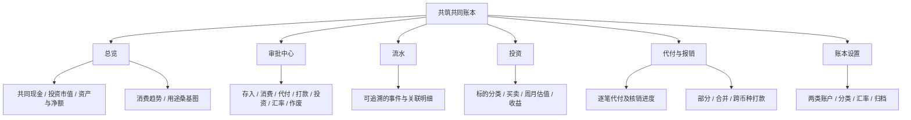
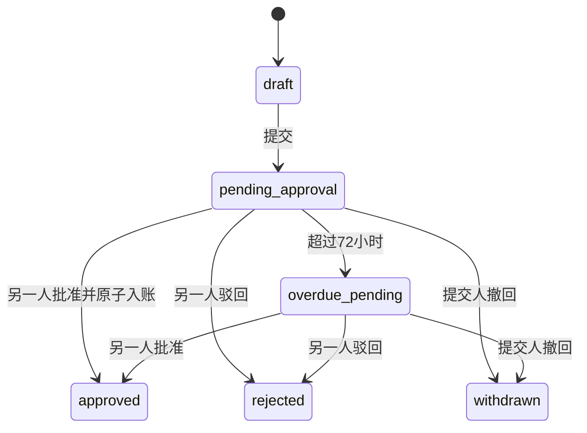
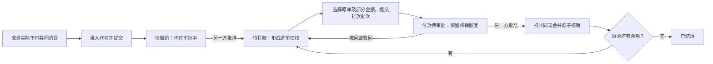

# 共筑 · 双人共同资金账本 PRD

版本：v1.1 评审稿；更新日期：2026-09-12\
依据：用户本轮需求，以及仓库 `main@3890578` 的代码审查\
交付范围：产品规则、功能架构、计算公式、交互要求、分期计划及验收标准；本次不实施应用开发\
关联文档：[现状审查](/Users/ariel/Documents/ChatGPT/GongZhu/repository-review.md)、[分期开发与验收计划](/Users/ariel/Documents/ChatGPT/GongZhu/GongZhu-Implementation-Plan-v1.1.md)、[测试与验收方案](/Users/ariel/Documents/ChatGPT/GongZhu/GongZhu-Test-Plan-v1.1.md)

本次修订：确认报销资金方向；界面统一CNY；增加玩乐/日用/购物及自定义分类；禁止两账户自动补足资金，增加显式“银行转入并买入”；买卖以实际扣款/净到账为准，不拆手续费；新增持仓涨跌幅、投资配置占比及扩展测试规格。v1.0保留为历史版本；本稿取代其冲突规则。

完成状态：七项补充的修订与文档校验已完成；应用开发尚未开始。中断恢复检查、发现并修正的问题及验证范围见[完成记录](/Users/ariel/Documents/ChatGPT/GongZhu/GongZhu-PRD-v1.1-Review.md)。

## 0. 阅读约定与决策记录

本文描述目标行为。原项目已经具备的能力继续复用；与原行为不同的规则，需要通过后续开发实现，不代表当前已可使用。

- **已确认**：用户已明确的范围和约束，实施时不得自行改变。
- **设计建议**：为形成可执行 PRD 补充的具体规则，随本稿一起评审，不冒充用户已确认。
- **已确认 D-01**：个人存入由共同账户收款；成员代付的报销由共同账户付给实际垫付人。两者是相反的资金方向，已由用户确认，不再保留方向歧义。

下列设计建议在本稿给出唯一默认规则，避免开发者临场选择：

| 编号 | 本稿建议 | 原因 |
|---|---|---|
| D-02 | 存入只记录贡献，不产生个人可支取余额或资产份额 | 共同资产不区分比例 |
| D-03 | 投资统一保留份额；估值默认输入总市值，兼容单位价格输入 | 保留原投资模型，支持准确的部分卖出和成本结转 |
| D-04 | 估值、汇率虽不改变原币现金，也需另一人批准后进入正式资产展示 | 用户要求双人确认共同资金动态，避免共享数字被单方直接覆盖 |
| D-05 | “代付获批”即确认全额可报销；实际报销数值在打款记录获批时入账 | 支持待报销、待打款、已打款阶段；没有真实支付系统集成 |
| D-06 | 报销批次只对应一个收款成员、一个付款账户和一种付款币种 | 部分/合并/跨币种仍可支持，同时保持每笔付款清晰 |
| D-07 | 归档是双人确认的只读关闭，可保留非零资产和未清偿项目 | 关闭账本不等于资产清零或债务结清 |

## 1. 产品目标、边界与成功标准

### 1.1 产品目标

为一对伴侣提供共同资金的统一记录、查看、审批和可视化工具。双方都能了解资金从哪里来、花在哪里、持有哪些投资、还有哪些共同消费需要报销。涉及金额和正式核算的变更，由一方提交、另一方确认。

共同资金来源是双方主动存入的共有资金。例如每人每月存入 USD 300，获批后共有资金增加 USD 600，归双方共有；系统不为两人各建立 USD 300 的个人权益余额。

### 1.2 已确认边界

1. 一个共同银行账户用于存款、消费和报销，一个共同券商账户用于投资。券商未投资现金也属于共同现金。
2. 支持 USD、HKD、CNY；本期界面的币种选择、金额、图表和提示均显示 `CNY`，不以RMB替代，存储代码继续使用 `CNY`。默认报告币种 USD。未来如增加导出，同样沿用CNY，但本期不因此新增导出功能。
3. 允许银行或券商的原币现金余额为负。负值清晰展示，但不阻止有效记账；持仓数量和可核销额度不能为负。
4. 只记录共同消费、共同存入、共同投资及相关代付、报销。个人日常消费和个人投资不纳入。
5. 成员代付仅记录个人为共同事项垫付的金额，不连接个人银行账户，不跟踪个人资产。
6. 投资只能由共同资金买入；银行与券商之间划转是内部转账，不是新存入。
7. 全部是数值记录、统计、审批和展示，不执行银行打款、券商交易或自动扣款。
8. 汇率默认由用户手动录入其查到的当前汇率；不宣称后台自动实时更新。
9. 银行现金和券商现金都不能因另一账户余额为负而自动被调用；每次跨账户变化必须来自用户明确填写并经另一人批准的划转或组合操作。
10. 暂不开发独立投资手续费/税费字段、分录或报表；买入用实际总扣款计成本，卖出/分红用实际净到账，系统不再加扣一次费用。

### 1.3 成功标准

- 同一笔事件在总览、流水、审批、投资和报销中心的金额一致，可点击追溯。
- 每一笔代付能查到用途、实际垫付人、原币金额、每次核销及剩余金额。
- 存入、内部转账、投资买卖和报销不会被重复计入消费。
- 同一组交易无论分页、展示排序或刷新方式如何，现金、持仓和成本结果一致。
- 同币种案例精确核对到分；跨币种案例明确使用的汇率版本和舍入规则。
- 既有页面布局、配色、品牌和主要操作习惯得到保留。

### 1.4 本期不包含

自动银行/券商同步、实际支付、自动行情或汇率抓取、个人财务、多成员家庭、所有权分配、预算/目标资金分配、借贷交易、做空、杠杆、期权、拆股和复杂公司行动。每月存入示例不是自动周期入账要求。上述功能不得因预留结构而默认上线。

本期不新增通用导入导出或完整资产负债表。专门的旧数据迁移核对及现有资料回读属于交付要求，不等同于提供用户通用导入功能；资产、往来与净额模型为未来报表提供基础。

## 2. 延续原设计的约束

### 2.1 必须保留

- “共筑”名称，现有浅米色背景、深绿色主色、卡片、圆角、顶部工具栏和页签布局。
- `总览 → 审批中心 → 流水 → 投资` 四个现有页签及“新建记录”主入口。
- 邮箱账号、两人加入同一账本、提交者不能自批的协作方式。
- Next.js + React + TypeScript + Tailwind + Supabase 架构，以及既有 RPC、RLS、Realtime 方向。
- 已有投资标的、流水、审批、估值和审计数据。

### 2.2 允许且必要的增量变化

- 新增一个一级页签“代付与报销”，内部切换“代付明细 / 报销打款”；不重做侧边栏或全站导航。
- 顶栏增加轻量“账本设置”入口，承载账户名称、汇率、分类及归档；沿用弹窗/抽屉形式。
- 现有新建记录表单增加用途、付款账户、实际付款人、交易日期等必要字段。
- 投资价格弹窗增加“持仓总市值”模式、估值日期和审批；保留单位价格录入习惯。
- 现有总览卡片与图表增加资产汇总、欠款提示和消费桑基图。
- 计算错误、文案错误、权限缺口必须修正；内部按需拆分组件不改变外观。

每个 UI 变更提交应提供原页与修改页对照，注明保留内容和改动对应的需求编号。不得以“顺便优化”为由换框架、换设计体系或整页重写。

## 3. 功能架构



| 模块 | 用户能完成的操作 | 不承担的核算职责 |
|---|---|---|
| 总览 | 看全部共有资产、欠款和消费方向；进入明细 | 不自行再写一套余额公式 |
| 审批中心 | 看变更前后、批准/驳回、撤回自己的待审记录 | 批准前不让正式金额生效 |
| 流水 | 按日期、用途、账户、币种、付款方式筛选，申请作废 | 不把展示分页当完整账本数据 |
| 投资 | 标的管理、交易、估值、成本收益追溯 | 不把估值变化当现金流 |
| 代付与报销 | 看谁垫付、为何垫付、如何核销、还需付多少 | 不建立成员个人资产账户 |
| 设置 | 账户元数据、用途分类、汇率、归档 | 不通过“修改余额”绕过审批 |

## 4. 统一业务对象与字段

### 4.1 四个必须分开的概念

| 概念 | 示例 | 用途 |
|---|---|---|
| 事件类型 | 存入、消费、代付、报销、投资买入 | 决定资金与资产如何变化 |
| 消费用途分类 `category` | 旅行、餐饮、交通、居住 | 决定消费统计和桑基图归类 |
| 具体事项 `project` | “2026 香港旅行”“周六晚餐” | 将多笔不同类别消费关联到同一件事 |
| 支付来源/付款方 | 共同银行、成员 A 代付 | 决定现金来源和成员垫款债务 |

“代付”“报销”不得作为消费类别。例：A 垫付香港旅行的晚餐，事件类型=代付，类别=餐饮，事项=2026 香港旅行，实际付款人=A。报销继承原代付的用途关联，不再创建消费。

类别必填，沿用现有类别并允许自定义；具体事项可选，可在表单中快速创建；说明必填，例如店名或用途。归档类别/事项不删除历史；已入账记录保存名称快照，修改历史归类需要审批。

在现有“日常生活、餐饮、居住、家居、交通、旅行、医疗健康、礼物、订阅服务、宠物、教育、其他”之外，增加“玩乐、日用、购物”。保留原分类和历史归属，不自动把日常生活/家居等重新归类。

分类选择中提供“新增分类”，同账本双方共享；名称去首尾空格，1—30个字符，归一化后不能与现有名称重复。类别名称只做统计维度，不改变资金性质。若某期因兼容问题暂不能交付新增分类，明确标为过渡方案：选择“其他”并填写必需的自定义用途备注；不能把备注伪装成已经实现独立分类统计。最终目标仍支持新增分类，过渡不得无声取代目标。

### 4.2 人、账户与角色

- `submitter`：录入并提交记录的人，系统自动取登录用户，不可冒充。
- `payer_member`：个人存入或成员代付的实际出资/垫付人，可与提交者不同，只能选账本的两名成员。
- `source_account / destination_account`：共同银行、共同券商；它们不属于任一成员。
- `payee_member`：报销款实际收款人，按已确认D-01固定为原代付人，不能随意选择第三人。
- `reviewer`：另一位活跃成员，不能等于提交者；审批权限与该笔谁付款无关。

### 4.3 通用记录字段

业务 ID、账本 ID、类型、原币金额、币种、发生日期时间、说明、提交者、实际付款人（适用时）、资金账户（适用时）、类别、事项、关联原单、汇率快照、提交时间、审批时间/人、状态、理由、幂等键及版本号。

发生时间与批准时间分开。允许补录已发生事项；不允许未来资金流水进入已入账状态。同一发生时间按账本内稳定序号重放，排序键为 `(occurred_at, effective_sequence, id)`。投资估值还需记录其所依据的持仓版本。

账本保存明确的IANA时区，创建时默认当前用户的浏览器时区并展示；双方所有日/月统计按同一账本时区归日，不能一人按UTC、一人按本地时间。时间戳统一存储；金额生效排序不因显示时区切换改变。

## 5. 双人审批与入账规则

### 5.1 状态流转



72 小时为本稿默认提醒阈值，不会自动批准、驳回或释放有效报销预留。逾期可按服务器时间派生标签，无需先依赖定时服务。草稿没有财务影响；驳回后可复制成新草稿，保留原审批记录。待审内容不直接编辑，先撤回再提交新版本。

proposal 使用 `approved`；生成的资金事件使用 `posted`；后续更正作废使用独立审批，将原事件标为 `voided`。不得再次混用 proposal 的 approved 与流水的 posted。

### 5.2 审批矩阵

| 操作 | 另一人批准 | 批准前正式数值是否变化 |
|---|---|---|
| 存入、期初确认、消费、退款、代付、报销打款 | 必须 | 否 |
| 银行/券商划转、实际换汇、银行转入并买入组合 | 必须 | 否 |
| 投资买入、卖出、现金分红 | 必须 | 否 |
| 投资估值、正式汇率更新 | 必须，设计建议 D-04 | 否，仅显示待审预览 |
| 已入账流水作废、历史分类更正 | 必须 | 否 |
| 账本归档、恢复 | 必须 | 否 |
| 新建零持仓标的、类别、事项、名称备注 | 不需要，但留操作历史 | 不影响金额 |
| 调整标的币种、账户类型、已有数量成本 | 不允许直接改 | 走受约束迁移/更正流程 |

批准资金记录表示双方确认这笔数值应计入账本，不触发真实转账。报销打款在批准时视为“已打款（已确认入账）”，不再另设无定义的第三次审批或后台支付状态。

### 5.3 审批详情必须展示

谁提交、谁实际付款、原币金额、报告币种折算、用途/事项、来源与去向、锁定汇率、关联单据、批准后余额/债务/持仓的变化。打款展示每笔分配；作废展示影响范围；估值展示所依据数量和日期。

对负现金展示变化后的负数和提示，但不阻止。超持仓、超核销、跨账本引用、缺失汇率、旧版本依赖失效必须阻止，返回具体原因。

所有批准在数据库事务内重新验证。报销锁原代付，投资锁标的，归档锁账本，不能仅凭前端预览批准。重复同一请求返回同一结果，双击与重试不新增流水。

## 6. 账户、币种与汇率

### 6.1 两个共同账户

共同银行和共同券商各有 USD、CNY、HKD 三个原币现金余额。界面默认折叠零余额，不代表银行真实开通了所有币种；账本按实际发生币种记账。

- 存入、消费和报销默认共同银行。
- 买卖、分红的交易结算账户为共同券商，币种取标的币种；买入资金来源可显式选择“现有券商现金”或“银行转入并买入”。
- 使用现有券商现金时，即使券商变成负数，银行现金也不变；银行消费/报销导致负数时，券商现金也不变。禁止自动划转、自动换汇、静默补差额。
- 相同币种的内部划转：银行减少 x，券商增加 x；共同现金总额、消费、贡献、资产总额都不变。
- 调整资金位置必须手工记录实际划转，不能直接覆盖两个账户余额；系统审批只调整账本数值，不操作真实银行或券商。

**银行转入并买入：** 用户主动选择此模式，明确填写银行转出额T、转入券商的到账额（同币种时等于T）和本次买入实际总扣款B。系统展示完整变化，另一人一次批准后原子完成“转入券商＋投资买入”。T不自动等于余额缺口；不能随余额或审批时现金变化重新生成金额。

```text
同币种组合：
  银行现金变化 = −T
  券商现金变化 = +T − B
  共同现金变化 = −B
  投资成本变化 = +B
  贡献、消费变化 = 0
```

例：银行USD600、券商USD20，手工转入T=300并买入B=200，批准后银行300、券商120、投资成本+200。若T=B=200，则银行400、券商仍20，但详情必须显示券商+200和−200的两步，不能遗漏或重复扣款。T小于B时可形成负券商现金，不自动从银行追加转入；T大于B的剩余保留在券商。

如果跨币种，从银行转出T_c、券商实际到账T_d、买入扣款B_d，银行c变化−T_c，券商d变化T_d−B_d，需锁定汇率和确认实际两侧金额。用户修改买入额时不静默修改T，重新展示变化后提交。组合任何一步失败，整体不入账；作废须整体检查依赖，不能只作废转入或买入的一半。

跨币种组合的报告币种共同现金变化为 `−convert(T_c) + convert(T_d) − convert(B_d)`，全部使用同一核对汇率；它只有在转出与到账的折算额相等时才简化为 `−convert(B_d)`。若实际净到账包含换汇价差/扣费，差额保留为6.4的净额折算差额，不当作消费、存入或投资交易收益。

组合适用于本次明确关联的转入和买入，事件内保留各子步骤的实际发生时点和顺序。已经单独入账的划转不得再次包进组合扣款；此时只提交“现有券商现金买入”，可以关联已入账划转作说明，但不重复生成其现金变化。

### 6.2 汇率定义

令 `r_c(t)` 表示在汇率版本 t 中 **1 USD 等于多少币种 c**：`r_USD = 1`，用户录入 `r_CNY`、`r_HKD`，已录入值均大于零，至少支持 8 位小数；未提供的币种标记为缺失，不默认为1。页面明确显示方向，禁止只显示一个无单位数字。

```text
从币种 c 换算为币种 d：convert(x, c→d, t) = x × r_d(t) / r_c(t)
USD 折算：usd(x, c, t) = x / r_c(t)
```

示例值仅用于验收，不是真实行情：`r_CNY=7.2, r_HKD=7.8`，则 CNY 720 = USD 100 = HKD 780。

汇率版本必须包含输入值、有效时间、录入者、审批者、来源备注和批准状态。更新采用整组快照；只改一项时另一项继承前一已批准版本并明确展示。账本默认 USD，个人临时切换报告币种只改变查看方式，不改原币流水。

### 6.3 当前资产与历史统计分开

| 场景 | 使用汇率 | 更新汇率后会不会变化 |
|---|---|---|
| 当前现金、投资资产、未偿还债务的报告币种展示 | 最新已批准、当前有效快照 | 会，原币金额不变 |
| 消费、存入贡献、已打款的历史报表 | 该业务事件锁定的快照 | 不会 |
| 跨币种报销结算 | 批次提交并最终批准的结算快照 | 不会，除非撤回重提 |
| 历史日期资产 | 当日有效汇率与当日有效持仓/估值 | 只有获批补录或更正才会改变，并标“已重算” |

未配置相关币种汇率时，允许保存草稿，不能批准需要折算或跨币种结算的记录；总览保留原币金额并标“折算待完善”，不能按 1:1 或 0 估算。USD 单币种不依赖外币汇率。

超过 24 小时未更新显示“汇率更新于…”，不自动禁用。界面名称为“手动汇率／最新已确认汇率”，不显示误导性的“自动实时”。

### 6.4 实际换汇与展示换算

手动汇率更新仅影响折算展示。真实数值上从 USD 换到 HKD 时，必须另录“换汇”：来源账户/币种和实际总扣款、目标账户/币种和实际净到账、发生时间。可以同账户换币，也可以银行转券商时同时换币，一个审批原子生成两条账户金额变化。已包含在两侧金额中的费用不另拆、不重复扣除。

```text
实际换汇比率（按净现金） = 目标币净到账额 / 来源币总扣款
换汇净资产变化（按同一报告汇率）
  = 折算(目标净到账额) − 折算(来源总扣款)
```

换汇不计存入或生活消费。实际净现金比率与展示汇率不相等的差额标为“换汇净额折算差额（可能包含价差及费用）”，不伪装成投资收益，也不声称已拆出纯汇兑收益。本期没有专用费用模块；独立发生且未包含于上述金额的银行收费，可另录普通共同消费“其他”并备注，不自动推算费用。

### 6.5 精度

货币流水以整数分保存；数量支持至少 6 位小数，单价/派生估值支持至少 8 位小数，计算用数据库 decimal / numeric 或等效十进制定点运算。允许估值为零；交易数量必须大于零。买卖权威金额明确到分：买入为实际总扣款，卖出为实际净到账，优先输入金额与数量并派生含费单位成本/净到账单价。

兼容原来的数量×单价输入时，单价明确标为“含费单位成本”或“净到账单价”，由此推导总金额，误差容许1分舍入；它不是另外一个可随意冲突的权威金额。若记录原始成交报价，仅作备注参考，因为费用可能已包含在实际扣款中，不能强迫实际扣款必须等于数量×原始报价，也不能再加手续费。

单条现金事件只舍入一次到币种分。聚合余额先按原币累加，再统一折算；历史统计按已锁定的逐条折算金额汇总。报销批次的分配尾差采用第 9 节规则，不得靠浮点误差抹掉债务。

金额采用明确的十进制四舍五入（half-up），负数按绝对值舍入后恢复符号；尾差分配处使用明确的向下取分规则。类型边界：买入实际扣款>0、数量>0；卖出净到账可为0、数量>0（例如零价处置），零到账卖出仍结转成本但不生成现金变化；分红>0；人工市值>=0。非该类型允许的零/负金额和非有限值必须拒绝。

## 7. 各类记账的完整影响矩阵

下表用 `x` 表示事件原币金额。欠成员款增加代表共同账本负债增加；成员债务只为核销服务，不是共有资产份额。

| 事件 | 共同现金 | 共同消费 | 贡献 | 投资数量/成本 | 欠成员款 |
|---|---:|---:|---:|---|---:|
| 已确认期初现金 | +x | 0 | 0 | 不变 | 0 |
| 成员共同存入 | +x | 0 | 实际存入人 +x | 不变 | 0 |
| 共同账户消费 | −x | +x | 0 | 不变 | 0 |
| 共同消费退款到共同账户 | +x | −x | 0 | 不变 | 依原单规则 |
| 成员代付共同消费 | 0 | +x | 0 | 不变 | +x |
| 向成员报销打款 | −付款币金额 | 0 | 0 | 不变 | −核销原币金额 |
| 同币种内部转账 | 合计0 | 0 | 0 | 不变 | 0 |
| 换汇 | 实际扣款一减、净到账一增 | 0 | 0 | 不变 | 0 |
| 投资买入 | −买入总支出 | 0 | 0 | 数量+，成本+ | 0 |
| 投资卖出 | +卖出净所得 | 0 | 0 | 数量−，结转成本 | 0 |
| 现金分红 | +分红净额 | 0 | 0 | 不变，分红收益+ | 0 |
| 投资估值更新 | 0 | 0 | 0 | 数量/成本不变，市值变 | 0 |
| 汇率更新 | 原币0 | 历史不变 | 历史不变 | 原币不变 | 原币不变 |
| 作废 | 排除原事件，重放其全部关联影响 | 同左 | 同左 | 同左 | 同左 |

作废不是新增一筆真实反向交易。真实退款、卖出和退款返还必须使用相应事件，不得用作废掩盖已经发生的真实资金流动。

## 8. 存入、消费与分类功能

### 8.1 共同存入

选择实际存入成员、共同收款账户、币种、金额、日期、说明。任一方可替另一方录入，提交者自动记录。批准后增加收款账户现金和该成员贡献统计。

贡献统计仅回答“累计存入多少”，不产生可取回金额、持仓比例或消费分摊。代付不计贡献，报销不冲减贡献，内部转账不计贡献。期初资金单列，不自动假定由某个人贡献。

### 8.2 共同消费与成员代付

新建记录保留现有入口和类别选择。用户选“共同账户消费”时选共同付款账户；选“成员代付共同消费”时选实际垫付成员。两者共享类别、事项、说明、币种、金额和日期。

每笔消费只选择一种来源。一次共同事项由两人或多个账户支付，录入多笔关联同一事项的消费/代付，金额按实际各自支付部分拆开；本期不引入一个表单里的复杂混合支付。

代付提交同时构成报销申请，不要求重复填写同一消费。批准后自动生成等额、同币种的可核销代付债权；不要求用户再提交一次“允许报销”的申请。

### 8.3 消费计算

```text
原币消费净额 = 共同账户消费 + 已批准成员代付 − 已批准关联退款
用途消费净额 = 该类别/事项下上述事件之和
历史报告币种消费 = Σ 每条事件的带符号锁定折算金额
```

报销打款、买卖实际扣款/净到账、内部划转和存入不计消费。投资费用已含于实际买入成本/卖出净所得，不再进入生活消费；其他独立银行收费如果确实发生且未计入别的金额，可用普通消费和备注记录，本期不引入专用费用类别或拆分模块。

一笔消费不能使用“代付／报销”类别。退款继承原消费类别与事项，允许查看跨期退款；退款本身不产生新的消费来源。

## 9. 代付、报销、打款与精确核销

本节采用已确认D-01：共同账户向实际垫付人报销，不改变双方共同资产的共有性质。

### 9.1 生命周期



两次确认分别确认“这确实是共同消费、应全额报销”和“这次按这些金额记为已打款”。付款申请只需选择已批准代付，禁止自由输入一笔没有来源的报销。

### 9.2 每笔代付的核算公式

令 `G_i` 为获批原代付金额，`F_i` 为退款给垫付成员、用于减少可报销部分的累计原币额，`S_i` 为已入账且未作废打款累计核销原币额，`R_i` 为有效待审批批次预留的原币额：

```text
有效可报销原额 A_i = G_i − F_i
尚欠成员 L_i = max(A_i − S_i, 0)
成员应返共同款 U_i = max(S_i − A_i, 0) − 已确认返还额
可新申请打款额度 V_i = L_i − R_i
```

正常付款必须保证 `V_i >= 0` 且本次原币分配 `0 < a_i <= V_i`。不允许把 `max(0, …)` 当作掩盖超报的办法；超额必须在事务中失败。成员应返共同款仅因退款等合法反向事件形成，不允许普通报销制造超付。

任一状态要求`0<=R_i<=L_i`，已确认返还额不得超过该原单已形成的应返款；不能把负U_i截成0掩盖超返。退款后历史S_i可以合法超过新的A_i，其超额等于尚待返还加已返还；后续作废/更正如果破坏该关系，必须先处理依赖，不能删除历史付款来凑平。

预留只锁核销额度，不提前扣现金、不提前减正式待打款债务。待审及逾期打款持有预留；撤回/驳回释放，批准后预留转成已核销，不可同时重复扣减。

### 9.3 部分报销与合并报销

部分：原单 CNY 300，本次核销 CNY 100，获批后余额 CNY 200。

合并：可以将同一成员的旅行、餐饮等多笔原单放入一批。默认按用户选择的各笔剩余金额填入，用户可逐笔减少；系统明确显示原单类别、事项、原币余额、本次核销和剩余金额，不静默决定用途。

不同成员不能混在一笔付款中；可连续创建两批。批次 ID 连接付款流水和分配表，任何时候都能从付款追到原消费，也能从原消费追到全部付款。

### 9.4 跨币种打款

一批可包含同一成员的不同币种代付，但只有一种付款币种。每条分配同时保存：原单币种、原币核销金额 `a_i`、该批次结算汇率、付款币金额 `b_i`。

```text
未舍入付款金额 b*_i = a_i × r_pay / r_claim_i
付款本金 B = round_to_cent(Σ b*_i)
核销额度始终用 a_i，与之后汇率更新无关
```

对每条 `b*_i` 先向下保留到分，再将 `B − Σ floor_to_cent(b*_i)` 的尾差按小数余数从大到小分配；余数相同时按 allocation ID 稳定排序。保证 `Σ b_i = B`，不能改变原币核销额来凑付款总数。批次本金以及每条正原币核销对应的最终付款分配都必须至少1分，不用0付款静默清掉正债权。

如果尾差分配后有某条仍为0，即使整批付款大于0也不批准该组合。用户可以在该原单剩余额度允许时增加本次核销额，或改用原币支付；同一原单重复选择必须先合并为一条分配。不能删除原单关联、把其他原单的款冒认到该单来绕过最低单位限制。

例：A 有餐饮代付 CNY 720，本次核销 CNY 360；汇率 1 USD = 7.2 CNY；用银行 USD 支付 50，原单还剩 CNY 360。以后汇率变成 7.5，剩余仍是 CNY 360，当前折算为 USD 48；已支付 USD 50 和已核销 CNY 360 都不重写。

汇率在提交时锁定，审批页同时展示来源和时点。实际约定付款金额不符时，撤回重提结算汇率或原币核销额，不允许批准后暗中调整。报销本金不混入独立银行收费；确有另扣款可按普通共同消费记录并关联说明，不减少成员被核销的本金、不自动生成费用。

### 9.5 “每人待报销、待打款、已打款”的唯一口径

| 卡片 | 计算口径 | 时间与汇率 |
|---|---|---|
| 待报销（代付审批中） | 该实际垫付成员处于待审/逾期的代付金额 | 当前状态；原币列示，当前确认汇率折算，仅作待审参考 |
| 待打款（已确认未偿还） | 该成员所有有效代付的 `Σ L_i` | 全部当前未清金额；最新确认汇率折算 |
| 其中付款审批中 | 上一项的子集 `Σ R_i`，不能与待打款再相加 | 原币额度与拟付款币金额分开 |
| 已打款 | 该成员有效 posted settlement 的实际付款金额 | 累计默认，可选期间；使用各付款锁定汇率 |

一笔代付部分付款后，同时存在“已付部分”和“待打款部分”，金额不重叠；这不是重复统计。已打款按付款币种统计，不与原币债权直接相减，原单详情用核销原币计算余额。

退款形成的“成员应返共同款”独立展示，不从另一成员或另一笔代付的待打款中自动抵销。页面不得出现“成员 A 的共同账户余额”或成员资产份额。

### 9.6 独立可视化界面

“代付明细”：按实际垫付人、类别、事项、币种、状态筛选；每笔进度条显示已核销/有效报销原额，旁边列待审预留，时间线显示消费确认、部分打款、退款、作废。

进度条使用 `min(S_i, A_i) / A_i`，不把退款后超付画成超过100%的报销；`A_i=0`时不用除法，显示“已全额退款”，有应返款另显“待返还”。原始代付额、退款额、已付额始终保留，进度条不能替代明细事实。

“报销打款”：每人三类状态卡片、待付款批次、已付款历史；批次详情展示一对多分配。按成员显示已确认代付的已付/未付堆叠条形图，待审批代付单列，不混入已确认总额。

两个子页面的数量和金额均可点击进入明细。人民币等原币与 USD 折算同时标识，禁止无单位叠加。

## 10. 投资：低频估值、买卖与收益

### 10.1 标的和分类

沿用现有投资页卡片。类别可为 ETF/基金、股票、债券、其他，可自定义；标的有名称、代码（可选）、类别、币种、单位名称（股/份/自定义）、备注、估值节奏（每周/每月）。一个标的只使用一种币种。

直接创建标的仍不需要资金审批，数量和成本固定为零。隐藏旧 RPC 任意创建有价期初持仓的入口；如已有共同资产需要迁移，使用专门的双人确认期初流程。禁止录入个人资产后将其视为共同买入。

本期统一保留份额模型，不同时开发一套无法核对成本的“只加减总金额”模型。没有自然数量的标的可以明确自定义计量单位，但不可凭每次市值随意重新定义单位；首次买入时确定，同一标的全程一致。若后续确需纯金额理财，将另行定义赎回比例规则。

### 10.2 默认按总市值更新

“更新估值”弹窗默认展示当前已确认份额，用户选日期并输入“这批持仓当前总价值”，币种固定为标的币种。可切换到现有“单位价格”输入；两种方式互相预览，保存同一估值模型。

```text
估值时已确认数量 Q_v > 0
用户输入总市值 V_v
派生单位价格 P_v = V_v / Q_v

此后数量为 Q_t、尚无更新估值时：暂估市值 M_t = round(Q_t × V_v / Q_v)
```

保存原始总市值、原始份额快照、估值时间、持仓序号边界、输入方式和高精度单价。总市值模式以原始V_v/Q_v为权威比值，使用高精度乘除后只在最终金额处舍入，不能拿显示或缓存中已舍入的单位价格反算。数量恰为Q_v时保持用户确认的V_v。新增买入/卖出改变数量时使用同一原始比值推算，并标“基于某日价格估算”；单位价格输入模式才以确认的单位价格为权威值。

买卖不能简单地永远加减旧总市值，估值涨跌也不能当作存入/消费。估值获批只改变市值与未实现收益，不产生现金或改变成本。

同一日期多次更新按明确发生时间和有效序号排序。待审估值不能覆盖最新确认估值。待审总市值所依赖的 Q_v 若被补录/作废改变，审批必须要求重算并重新确认，不能静默用旧总市值除以新份额。

周/月节奏用于页内“本周待更新／本月待更新”列表和上次更新时间；本期不创建后台行情抓取、外部通知或自动估值任务。

### 10.3 买入、卖出、现金分红

买入：选择标的、发生时间、数量、实际总扣款和备注；币种固定标的币种。默认“现有券商现金”，可主动切换“银行转入并买入”，按6.1记录固定金额的组合。实际总扣款默认已包含券商扣费，不新增手续费输入。批准后同步改变相应账户现金并增加持仓和成本。

卖出：选择已持有标的、时间、数量、实际净到账。界面显示可卖量及预计结转成本；批准时重新计算整段历史，不能卖出超过当时可用持仓。卖出所得只进入券商现金，不自动转回银行。允许现金为负不等于允许负持仓。

现金分红：录入标的币种和实际净到账额，批准后券商现金增加该净额、累计分红增加该净额；持仓和成本不变，不拆税费。红利再投在本期以“现金分红 + 投资买入”两项关联记录表达，两项都必须批准，不暗中增加份额或划转银行资金。

### 10.4 移动加权平均成本公式

令 Q 为买卖前数量，C 为剩余成本，q 为本次数量，B 为已含扣费的买入实际总扣款，S 为卖出实际净到账，R 为累计已实现收益，D 为累计净分红：

```text
买入：
  投资买入子事件的券商现金变化 = −B
  如为银行转入组合，再加入6.1两侧划转明细；同币种合计−B，跨币种还含净额折算差额
  Q_new = Q + q
  C_new = C + B

卖出（0 < q <= Q）：
  结转成本 C_out = round(C × q / Q)
  若 q = Q，则 C_out = C，消除最后一笔成本尾差
  券商现金变化 = S
  Q_new = Q − q
  C_new = C − C_out
  R_new = R + (S − C_out)

现金分红：
  现金变化 = 净分红 d
  D_new = D + d

市值 M = 单位价格模式round(Q × 确认单价)，或总市值模式round(Q × V_v / Q_v)
未实现收益 U = M − C
标的累计总收益 T = R + U + D
```

上述U和T需要有有效估值依据；仅有成本暂估时，已实现R和分红D仍可单列，U及含U的完整T显示“待估值”，不能将暂估U=0冒充实际完整收益。银行转入组合的贡献和消费均为0，实际换汇差额单独解释。

实际金额已体现费用影响，系统不再分别加减费用。例如100份参考报价10、实际扣款1,002，成本就是1,002、含费单位成本10.02；卖40份实际到账598时，结转成本400.80，已实现收益197.20。原报价可备注，不能据它将成本改回1,000。各收益以标的原币先计算，再按当前汇率提供“原币收益的当前折算”，不得把它标成含汇兑影响的USD投资回报率。

本期必须提供10.7定义的持仓涨跌幅；不做年化、XIRR、时间加权收益率或未经定义的累计收益率。若展示全账本资产变化，汇率变化另列“折算变化”，不能计为交易已实现收益。

### 10.5 缺少价格与低频估值

- 无持仓：市值与剩余成本为零，可以保留历史收益。
- 有持仓、从未人工估值：按当前剩余成本暂估市值，标“成本暂估／待估值”，涨跌额/涨跌幅显示“—（未估值）”，不能用成本暂估的0收益冒充实际行情表现；若为迁移期初，同样明确标识。
- 已有人工估值：沿用最近有效估值，显示日期与周/月逾期提示；新增交易后提示建议更新。
- 人工确认总市值为零：允许，代表实际零估值，与“没有价格”区分。
- 全部卖出后再买入：旧历史估值不作为新批持仓的有效行情；先用新持仓成本暂估，等待新的人工估值，保留原批已实现收益历史。
- 已确认估值无法得到足够历史数量依据：展示“待核对”，不显示假零或静默忽略交易。

### 10.6 三个必须通过的例子

**例 I-01：先买后卖。** 买 100 份×USD10，再卖 40 份×USD15。余 60 份、成本 USD600、已实现收益 USD200。查询展示倒序不影响结果。

**例 I-02：按总市值估值。** 买 100 份成本 USD1,000，确认总市值 USD1,200，派生每份 USD12；之后买 50 份×USD12，数量150、成本1,600、按旧价暂估市值1,800、浮盈200。新买入600没有被算成收益。再以每份14卖出60份，结转成本640、净所得840、已实现收益200；剩90份、成本960；旧单位估值12下市值1,080、浮盈120。

**例 I-03：精度。** 100 份以 USD1.2345 买入，成本 USD123.45；同样单位价格估值时市值仍为123.45，浮盈0，不出现原项目的虚假负0.45。

### 10.7 当前持仓涨跌幅

每个标的显示当前市值M、剩余投入成本C、浮动盈亏M−C和持仓涨跌幅：

```text
持仓涨跌幅 = (当前市值 M − 剩余持仓成本 C) / C × 100%，C > 0
等价于：(当前单位价值 − 持仓平均单位成本) / 持仓平均单位成本 × 100%
```

分母是当前剩余持仓所对应的成本，包含买入实际扣费；部分卖出已经结转的成本不能再次保留在分母。已实现收益和分红单列；不得把它们加进浮盈分子后仍叫“持仓涨跌幅”。

例：投入1,000，市值1,200，涨20%；卖掉40%的持仓后剩余成本600、相同单位估值下市值720，仍涨20%，不能用720与历史全部投入1,000比较成跌28%。

新增买入可能改变涨跌幅，因为平均成本变化；它不应凭空改变已实现收益。按I-02加仓后，M1,800、C1,600，涨12.50%；再卖出后M1,080、C960，仍涨12.50%。

边界：实际确认市值0且C>0，显示−100%；清仓Q=0/C=0显示“已清仓，—”；有数量但成本0显示“无成本基数，—”；成本暂估、缺行情或失效估值显示“待估值，—”，不显示0%、无限大或NaN。已有人工估值过期时可继续显示基于该日期的幅度，同时标注过期。日常界面显示两位小数，计算保留精度，涨跌用正负号/文字和颜色共同表达。

比率按标的原币计算，不受只改变报告汇率的影响。当前汇率仅改变该金额的USD折算；不将汇兑波动混入这个涨跌幅。若提供组合持仓涨跌幅，使用全部当前持仓折算后的总浮盈/总剩余成本，不简单平均各标的百分比，并标“当前汇率折算口径”。

含未估值/成本暂估持仓的组合不显示确定的整体持仓涨跌幅；明细可分别显示有依据的标的涨跌，不能排除未知项后冒充全组合收益率。

### 10.8 投资资产配置可视化

在原投资页顶部增量增加环形图和明细表，不改变页签/卡片风格。支持“按标的”和“按投资类别”切换；显示市值、投资组合内占比、估值日期/来源、当前持仓涨跌幅。默认不设置目标比例、调仓建议或自动交易。

```text
m_j = 将标的j当前市值按同一已确认汇率折为USD
投资资产总值 I = Σ 当前持有标的 m_j
标的占比 w_j = m_j / I × 100%，I > 0
类别占比 = 该类别内各标的m_j之和 / I × 100%
```

分母只包含投资标的市值，不包含银行现金、券商未投资现金、代付欠款或成员个人资产；不能把“占所有投资的比例”与“占共同全部资产的比例”混用。清仓标的不占图表面积，历史记录仍可查。

例：标的A市值USD600、B市值CNY2,880、r_CNY7.2，B折为USD400，总投资1,000，占比分别60%/40%。修改汇率后占比会变化，即使原币持仓和本币涨跌幅都未变化。

完整数据下占比合计100%；显示小数尾差通过稳定最大余数分配，使表格两位小数合计100.00%，底层原始金额/比例不改，图表按原始值绘制。总投资0时显示“暂无可分配的投资市值”，不能除以0。

存在明确的成本暂估时，可以纳入“含暂估值的配置”并对全图及对应标的标注；若任一持仓缺失必要汇率、成本或有效估值依据，不能把它当0或把已知部分重新归一化成完整100%，应显示原币明细与“配置占比待完善”。

总览另可用已有卡片/小图解释“银行现金／券商现金／投资资产”；现金为负时用有符号表格或条形图，不能将负现金绘成负面积环形图。未来如扩展资产负债表，可沿用资产、成员应返款、未报销垫款、净额等对象，本期不引入完整财务报表或把资产配置比例解释为两名成员的所有权比例。

### 10.9 扩展场景与验证位置

I-01至I-03只是基础例，不能代表完整测试覆盖。银行资金组合买入、含费实际金额、加仓/部分卖出、清仓再买、零估值、跨币种配置、汇率改变、退款返还、并发核销、历史补录/作废和迁移均需覆盖。详见[测试与验收方案](/Users/ariel/Documents/ChatGPT/GongZhu/GongZhu-Test-Plan-v1.1.md)，其中列出输入、步骤、预期数值和验证层级。新增规格不代表当前应用已实现或通过这些测试。

## 11. 退款、返还与更正

### 11.1 真实退款必须关联原消费

退款记录包含原消费、原币退款金额、实际收款方、日期及说明；总退款不得超过原消费原币可退金额。退款消费类别/事项继承原单，不另算“退款类消费”。本期退款核销以原消费币种为准，跨币种退款的实际差额不能未经定义混入报销核销。

| 原支付来源与退款去向 | 现金变化 | 消费变化 | 垫款/返还变化 |
|---|---|---|---|
| 共同账户消费，退款回共同账户 | 收款账户 +x | −x | 无 |
| 成员代付，退款回原垫付人 | 共同现金0 | −x | 减少可报销原额；若已付过多形成成员应返共同款 |
| 成员代付，退款直接回共同账户 | 收款账户 +x | −x | 仍欠成员原来实际垫付金额，不能同时减少欠款 |

例：A 垫付300，共同账户已报销300，商家再退给A100。消费净额变200，共同现金此时不变，A需返还共同账户100。A返还100获批后，共同现金+100、应返款−100，贡献不增加、消费不再减少。该往来只追踪共同事项产生的债务，不构成个人资产管理。

“成员退款返还”必须关联应返款，允许部分返还；如果使用不同付款币种，复用第9节双币种额度/付款金额分离规则。不得用新的“共同存入”替代，否则会错误增加贡献。

有付款预留时，退款若会使某笔预留超过剩余，应先撤回/驳回相关批次，或在同一明确列出的更正事务中释放；不能保留超额预留等待后续失败。

### 11.2 已入账流水作废

两人均可对已有有效流水发起作废，必须填原因；另一方批准。原单和原审批永久可查，不物理删除。批准后原事件的财务效果从重算中排除，保存作废者、批准者、时间、原因、影响摘要与关联替代单。

若记录内容错误，可“申请作废并重建”：生成互相关联的作废提案和替代草稿；替代也需审批。需要二者原子生效时使用明确展示的更正组合提案，不能产生短暂重复现金或漏核销。

| 作废对象 | 必须检查的依赖 |
|---|---|
| 普通存入/共同消费 | 关联退款、费用及更正；作废后允许现金为负 |
| 原代付消费 | 有有效打款、退款或付款预留时禁止直接作废；先处理依赖 |
| 报销打款 | 同步恢复所有原币核销额度及对应欠款，返还共同现金数值；先检查后续成员返还等依赖 |
| 投资买入/卖出 | 从发生位置重放全部后续交易；若出现超卖、估值份额依据失效，必须一并更正或阻止 |
| 内部转账/换汇/银行转入并买入 | 同一组合全部账户明细、投资交易整体检查与作废，不允许单边撤销 |
| 退款/成员返还 | 检查相关债权、已付金额及后续返还依赖，重算后不得形成非法预留 |

资金真的已经退回或卖出时，应记录真实业务事件，不能作废原有真实事件来假装没发生。作废可重算历史日期统计；页面标记数据已重算，审计记录保留更正前后摘要。

估值和汇率更正也走审批。已被结算/历史统计引用的汇率快照不删除或改写，新的汇率不会追溯改已确认付款；确需改历史交易汇率时，走关联交易更正并显示重算影响。

## 12. 总览指标与消费桑基图

### 12.1 资产公式

令 `C_a,c` 为共同账户 a 的币种 c 现金，`M_j` 为投资 j 原币市值，`L_i` 为代付未偿金额，`U_i` 为成员应返共同款，统一采用当前已批准汇率 t：

```text
共同现金 Cash = Σ_a,c convert(C_a,c → USD, t)
共同投资资产 Investments = Σ_j convert(M_j → USD, t)
共同资产总额 Assets = Cash + Investments
未报销垫款 Payables = Σ_i convert(L_i → USD, t)
成员应返共同款 Receivables = Σ_i convert(U_i → USD, t)
扣除往来后的净额 Net = Assets − Payables + Receivables
```

若无应返款，净额就是“共同现金＋投资市值−未报销垫款”。这些均属于共同账本，不按人分成两份。负现金参与带符号计算，不归零。

投资资产只含已持有标的市值；券商未投资现金放在共同现金。若券商页面显示“总权益”，不能把含现金的总权益与共同现金再相加。

### 12.2 保持现有总览风格的展示

第一排沿用卡片：共同现金、共同投资资产、共同资产总额；下方补充未报销垫款、成员应返共同款（非零时显示）及扣除往来后的净额。卡片均标 USD 和汇率更新时间；点开现金可见银行/券商的原币余额。

待审批金额独立显示，不计入正式资产。资产卡片默认当前全部账本状态；消费图表日期筛选不改变这些卡片，避免“本月资产余额”被误算成当月流水之和。如用户明确选择历史资产日期，所有卡片、价格和汇率一同切换到该日期。

消费趋势保留现有折线图，日期正序、缺失日期补零，拆分共同账户消费和成员代付，可显示退款后的净消费。负净消费日显示负值，不截成零。

### 12.3 消费方向桑基图

主图路径为：`资金支付来源（共同银行/共同券商/成员代付） → 消费用途类别 → 具体事项`。未指定事项用“未指定事项”。成员代付来源可展开A/B，以便解释垫付来源；类别和事项不包含“报销”。

主图标题明确“消费发生额（未扣退款）”，只绘制选定日期范围内有效消费/代付的正向发生金额，按各事件锁定汇率折算。上方并列显示：消费发生额、当期退款额、当期净消费。

由于当期可能退回上月消费，退款不能简单丢弃或塞进不支持负值的主图。以独立“退款流向”区展示 `原消费类别 → 退款去向（共同账户/原垫付成员）`，使用正值表示退款额；净消费=消费发生额−当期退款，可为负。两个图共用日期范围，但各按自身发生日期取数。

每条边能点击查看相应原始消费或退款。报销付款和成员返还不进入消费桑基图，避免同一共同事项先代付、后报销被计算两次。每层节点流入/流出与相应表格金额一致；无数据展示空状态，不能展示演示数字。

## 13. 账本关闭、归档与恢复

“关闭账本”即归档，不清零、不分割资产、不执行真实销户。

流程：任一成员发起 → 展示当前银行/券商现金、投资、未清垫款/返还、待审事项 → 另一成员批准 → 状态 `archived`、保存快照、停止正式数据变更。

- 除本次归档提案外，有待审批/逾期提案、有效付款预留或未解决迁移问题时不能完成归档，先处理它们。
- 允许有非零或负现金、投资持仓、未清偿代付，但批准页必须清楚列出，双方确认“仅关闭记录，未结清事项保留”。
- 归档后所有资金提交、批准、价格、汇率、类别/标的修改、邀请接受和作废入口都被服务端拒绝；只可读、筛选和查看历史。
- 归档时冻结用于资产展示的汇率和估值快照，默认总览保持归档时数值，不随后续其他账本或外部行情变化。
- 用户仍可查看审计和待偿还明细；归档不自动给任何成员“已报销”状态。
- 两名原活跃成员可通过“恢复账本”专用流程双人确认，恢复后才能继续记账或更正。该流程是归档只读状态唯一允许的管理提案写入例外。
- 批准普通交易与批准归档必须共享账本锁/状态检查，不能在检查完成后又并发写入一笔普通资金事件。

## 14. 数据与实现契约

本节限定功能实现的事实来源和兼容方式，不要求推倒重建。

### 14.1 沿用并扩展现有对象

| 对象 | 增量要求 |
|---|---|
| households / memberships | 保留；增加账本版本、时区、状态快照引用及双人归档流程 |
| accounts（新增） | 仅银行、券商两类共同账户；不新增个人资产账户 |
| proposals | 保留；版本化 payload、严格按类型校验、请求幂等、关联依赖和更正原因 |
| ledger_entries | 保留事件头；明确成员角色、原单、用途、事项、稳定发生顺序、汇率快照及作废关联 |
| account_movements（新增） | 一条事件/组合的带符号账户现金明细，支持转账双边及显式银行转入后买入；同事务写入，已含费金额不拆重复分录 |
| categories / projects（增量） | 用途类别、具体事项和名称快照；映射既有 category 文本 |
| investments | 保留类别与备注；份额/价格精度升级，不开放任意改成本 |
| investment_valuations | 保留；追加总市值、估值数量、依据序号、输入模式、审批和有效性 |
| fx_rates | 保留既有数据，追加快照版本关联和批准/有效时间；历史引用不可变 |
| reimbursement_claims | 复用现有表，从获批代付原子生成一对一债权 |
| settlement_allocations | 复用并扩展原币核销额、付款币分配额及汇率版本 |
| settlement_batches / reservations | 支持审批前批次与逐笔原币预留，批准后转换为有效分配 |
| member_recoveries（必要增量） | 只记录共同退款形成的成员应返款及关联返还，不形成成员权益账户 |
| audit_logs | 覆盖提交、批准、驳回、撤回、估值汇率、核销、作废、归档和迁移 |

若技术设计采用不同表名，可以等价实现，但不能省略相应业务事实或让同一金额有两套可编辑来源。

### 14.2 唯一核算来源

原币现金以有效账户现金明细汇总为准；投资以按稳定顺序重放的有效交易为准；欠款以有效代付、退款、核销及返还为准。前端只消费统一查询结果和用于输入预览的同规则函数，不在 Dashboard 再写一套 cashImpact。

旧 `cashImpact` 与新账户明细不得同时计入现金。迁移期间每条事件明确使用旧适配还是新明细，不能既算头金额又算 movements。

正式查询必须在服务端对全量有效数据汇总，页面分页仅影响列表。总览返回同一个账本版本的现金、投资和欠款；修改成功后整体刷新版本，避免现金更新而持仓仍旧。

### 14.3 后端校验最低要求

- 使用类型区分的schema：买卖必须有标的、数量、实际总扣款/净到账；代付必须有实际垫付人、用途；付款必须有分配；换汇必须有两侧实际金额；银行转入并买入必须有用户明确指定的固定划转额与买入额。
- SQL 显式拒绝必须字段为 NULL，不依赖 `NULL <= 0` 判断；字段精度和上限在 API 与数据库一致。
- 所有可调用 RPC 包括旧入口都检查成员、同账本资源、active 状态和权限；不靠隐藏按钮实现权限。
- 提交报销时原子校验并预留，批准时锁定原单再验证；唯一约束覆盖幂等和 source_entry 一对一债权。
- 投资回放遇到非法卖出直接返回明确错误，不能静默跳过；补录和作废都重算后续依赖。
- 返回结构化业务错误，不把查询失败变成空数组/零余额；跨账本引用和未授权调用不泄露数据。
- 无网络/刷新失败时保留表单内容；提交中按钮禁用；同一草稿使用稳定幂等键，重试复用。

### 14.4 现有数据迁移

先做只读盘点和预演，不重置数据库、不改写已执行迁移文件。新增迁移必须可在现有库增量应用，并验证全新安装。

历史 `member_id` 只知道提交者，不能假设就是垫付人/收款人；历史报销无原单分配，不得悄悄按顺序自动核销。生成待核对列表，由双方确认实际成员和分配；无法确定的历史欠款显示“待核对”，不能作为确定余额允许新核销。

历史币种与原额原样保留。没有当时汇率时不得捏造“实时汇率”；由用户提供/确认历史估算快照并标注估算来源，未完成的折算保持缺失提示。

历史无账户归属时，采用明确切换日：双方确认银行/券商每币种期初分布，其合计必须与修正后旧共同现金一致；这只是余额归属拆分，不计新贡献或收入。旧流水仍保留历史查询和消费统计。

切换日之后账户余额从确认期初＋后续 movements 计算，不能再把切换日前旧现金流水叠加一次。投资也必须在“全历史重放”和“确认期初＋之后交易”中二选一作为每段的核算模式，不能重复算期初。后续如需补录切换日前记录，进入迁移更正流程并重新确认期初快照，不能自动绕过。

高精度升级准确映射已有 milli 数量和 minor 单价；旧值只能恢复原有精度，不制造历史小数。旧的错误投资汇总通过真实交易重放修正，出具前后差异由双方核对。

## 15. 端到端数值验收例

### 15.1 共有资金、代付和投资全链路

全部使用 USD、无费用，单价按例中最新人工估值。所有行均表示已经获得另一方批准：

| 动作 | 银行现金 | 券商现金 | 共同现金 | 投资市值 | 欠A | 共同资产总额 | 扣往来净额 | 累计消费 |
|---|---:|---:|---:|---:|---:|---:|---:|---:|
| A存300，B存300 | 600 | 0 | 600 | 0 | 0 | 600 | 600 | 0 |
| 银行共同消费100 | 500 | 0 | 500 | 0 | 0 | 500 | 500 | 100 |
| A代付旅行120 | 500 | 0 | 500 | 0 | 120 | 500 | 380 | 220 |
| 向A部分打款50 | 450 | 0 | 450 | 0 | 70 | 450 | 380 | 220 |
| 银行转券商200 | 250 | 200 | 450 | 0 | 70 | 450 | 380 | 220 |
| 买20份×10 | 250 | 0 | 250 | 200（成本暂估，涨跌幅待估值） | 70 | 450 | 380 | 220 |
| 更新总市值240 | 250 | 0 | 250 | 240 | 70 | 490 | 420 | 220 |
| 卖5份×14 | 250 | 70 | 320 | 180（剩15份×旧估值12） | 70 | 500 | 430 | 220 |
| 分红5 | 250 | 75 | 325 | 180 | 70 | 505 | 435 | 220 |
| 银行补报销70 | 180 | 75 | 255 | 180 | 0 | 435 | 435 | 220 |

最终投资剩余成本150、已实现收益20、浮盈30、分红5。净额核对：`贡献600 − 消费220 + 已实现20 + 浮盈30 + 分红5 = 435`。报销和内部划转不额外改变净额；各会改变对应现金/债务位置。

### 15.2 同人多单跨币种合并

A 有 CNY720 旅行代付和 HKD780 餐饮代付；汇率 r_CNY7.2、r_HKD7.8。一次 USD150 打款分配为：旅行核销 CNY360（USD50），餐饮核销 HKD780（USD100）。批准前两单分别预留360/780原币、现金不变；批准后现金−150，原单余额分别CNY360和HKD0，消费不变。

再把 r_CNY 改为7.5并批准，尚欠原币CNY360不变、当前折算USD48；旧消费和USD150打款历史不变。其他成员B的代付不受影响。

### 15.3 并发、作废与历史

同一代付余额100，两人几乎同时各申请核销80，只允许一笔预留成功，另一笔提示可用20；不得两笔都获批。撤回第一笔后可用恢复100。

原代付100已打款40，不能直接作废原代付。先作废打款（现金数值+40、欠款恢复100），再按依赖规则作废原代付（消费−100、欠款归零）。若真实资金其实已付出，应该记录返还，不走这个作废案例。

历史日期买100再卖40，无论页面按什么顺序展示，都剩60。作废买入导致后续超卖时阻止；不得忽略卖出、产生负持仓或“修复”为零。

## 16. 分期实施与发布门槛

详细工作包、涉及文件、依赖和验收用例见配套实施计划。按以下顺序，每期依据确认后的PRD小步实施与验收，不同时重做全站：

| 阶段 | 完成的用户能力 | 依赖 |
|---|---|---|
| P0 | PRD规则确认、设计基线、数据盘点与迁移预演方案 | D-01已确认，审阅其余设计建议 |
| P1 | 现有计算和审批基础可靠，已知严重错误有回归保护 | P0 |
| P2 | 银行/券商、三币种汇率、划转换汇和真实用途分类 | P1 |
| P3 | 代付逐笔形成可报销债权，实际付款人与提交人分离 | P2 |
| P4 | 部分/合并/跨币种打款、预留与独立报销可视化 | P3 |
| P5 | 投资总市值、周/月估值、实际金额买卖、持仓涨跌幅及配置占比 | P2；集成验收接P4 |
| P6 | 关联退款、应返款、已入账流水作废与依赖更正 | P4、P5 |
| P7 | 统一资产总览、消费趋势与桑基图 | P2—P6 |
| P8 | 双人归档/恢复、历史迁移、完整端到端验收与发布 | 全部前置阶段 |

P1 的修复可以独立验收；P2—P7 在完整闭环前以开发/测试环境或功能开关交付，不能对真实账本开放尚无对应核销或更正路径的半成品。P8 全部通过后再切换真实数据。

每期的固定验收门槛：需求用例通过、财务公式可复算、数据库事务/权限测试通过、两人交互可演示、原页面视觉对照通过、无历史数据无声丢失。没有这些证据不能仅凭“页面能打开”判定完成。

## 17. 全项目验收清单

- [ ] 双方均可查看和提交；双方任一方都不能审批自己提交的记录。
- [ ] 两账户现金允许负数，持仓/预留/核销不允许非法负数。
- [ ] 个人存入只增加共有现金及贡献统计，无成员所有权余额。
- [ ] 消费用途与支付方式分离，代付和报销不成为用途类别。
- [ ] 代付批准后全额形成债权；打款前不扣现金。
- [ ] 部分/合并/跨币种核销逐笔可追溯、原币额度不随汇率漂移。
- [ ] 待报销/待打款/付款审批中/已打款的时间与币种口径清楚。
- [ ] 投资份额与成本按稳定时间序列计算，正确支持周/月总市值估值。
- [ ] 买入实际扣款已含费用，卖出/分红用净到账，没有第二次扣费。
- [ ] 银行和券商负余额都不触发自动划转；银行资金买入金额显式指定，组合原子生效。
- [ ] CNY界面显示统一，玩乐/日用/购物及新增用途分类可使用。
- [ ] 涨跌幅使用剩余成本，清仓/零成本/未估值状态不显示伪百分比。
- [ ] 标的/类别投资配置以同汇率市值为分母，现金不混入，完整数据比例合计100%。
- [ ] 缺失汇率/估值明确标注，不用0或1:1掩盖问题。
- [ ] 当前资产折算可变化，历史消费和结算保留锁定快照。
- [ ] 银行→券商划转不改变共有现金总额或贡献，券商现金不漏算。
- [ ] 桑基图能追到消费，退款有去向，报销不再次计消费。
- [ ] 退款到个人与共同账户效果不同，已报销后的个人退款有返还闭环。
- [ ] 作废保留审计，完整处理转账双边、核销和后续投资依赖。
- [ ] 归档后的所有普通写入被数据库拒绝，双人恢复后才可继续。
- [ ] 超过1000条、分页变化、重复点击、并发审批都不会让金额错误。
- [ ] 旧数据迁移不假定付款人、不自动猜测核销关系、不重复增加资产。
- [ ] 原有配色、页签和主要表单习惯保留，变更均能对应本PRD条目。

## 18. 需求覆盖映射

| 用户要求 | 对应章节 / 阶段 |
|---|---|
| 两人共同账户动态与审批 | 1、3、4、5；P1起贯穿全部 |
| 分类投资、周/月更新当前价值、买卖逻辑 | 10；P1修复＋P5完善 |
| HKD/USD/CNY，默认USD，手动当前汇率 | 6；P2 |
| 代付报销归结旅行/吃饭等具体项目 | 4、8、9；P2—P4 |
| 账本关闭/归档与已入账作废 | 11、13；P6、P8 |
| 共同现金、共同投资、共同资产汇总 | 12；P7 |
| 消费方向桑基图 | 12.3；P7 |
| 每笔代付精确分配报销/打款 | 9；P4 |
| 每人待报销、待打款、已打款统计 | 9.5；P4 |
| 独立代付/报销可视化 | 9.6；P4 |
| 解决本次发现的问题 | 14、配套计划缺陷映射；P1—P8 |
| 两个共同账户、负余额、不分成员权益 | 1、6、8、12 |
| 部分/合并/跨币种结算 | 9.2—9.4 |
| 只允许共同资金投资 | 1、6、10 |
| 保持初始设计 | 2及每期视觉验收 |
| 增加玩乐/日用/购物、支持自定义消费分类 | 4.1、8；P2 |
| 两账户不自动挪用，支持显式银行转入并买入 | 6.1、10.3；P2、P5 |
| 手续费不单拆，采用含费扣款和净到账 | 6.5、10.3—10.4；P5 |
| 当前持仓涨跌幅和标的/类别资产配置 | 10.7—10.8；P5 |
| 除三个基础例之外的重要场景和测试保证 | 10.9、测试与验收方案；全部阶段 |
